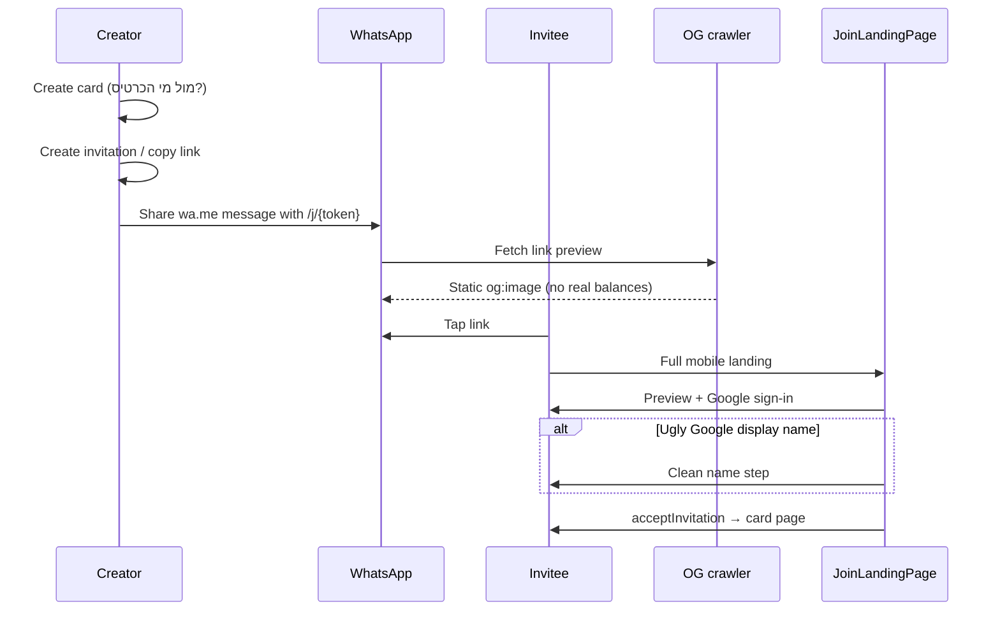

# 03 — Invitation & Join UX

Exact flows as implemented in code (`invitePaths.ts`, `whatsappShare.ts`, `JoinPreviewScreen.tsx`, `joinOpenGraph.ts`).

## End-to-end flow



## Step 1 — Creator creates card

- **Label:** «מול מי הכרטיס?»
- **Placeholder (create form):** «לדוגמה: שמעון כהן, חברת אלפא, ספק קבוע»
- **Helper:** «זה השם שיופיע אצלך בדשבורד.»
- Stored as card `title` (creator’s label); after two join, dashboard often shows **other party’s display name** instead.

## Step 2 — Creator shares WhatsApp invite

**Approved message** (`buildInviteWhatsAppMessage`):

```
פתחתי לנו כרטיס חשבון משותף — מקום מסודר לנהל את החשבון בינינו.
כנס כאן 👇🏼
{link}
```

`{link}` = absolute URL with **`/j/{token}`** when using share helpers.

## Step 3 — Preview layer (before click)

- **WhatsApp / Meta / crawlers:** `opengraph-image` — static headline e.g. «כרטיס חשבון משותף», mock phone UI with **fake** status («2 החלטות ממתינות לאישורך») — **not** live data.
- **metadata:** `joinOpenGraph.ts` — `JOIN_OG_TITLE`, description, absolute image URL from stable origin.

## Step 4 — Click layer — Join landing

- Routes: **`/j/[token]`** (primary), **`/join/[token]`** (legacy)
- Component: `JoinLandingPage` → `JoinPreviewScreen`
- **Headline:** «כרטיס חשבון משותף»
- **Optional subline:** «נשלח מ־{inviterDisplayName}» if preview returns clean inviter name
- **Value prose:** «מקום מסודר לתיעוד חיובים והחזרים בין שני צדדים…»
- Guest CTA: «כניסה עם Google»
- After login: «כניסה לכרטיס» or auto-accept if display name already clean + join intent consumed

## Step 5 — Clean display name (when needed)

Shown when `!isCleanDisplayName(user.displayName)` after Google sign-in.

| UI element | Copy |
|------------|------|
| Label | איך תרצה שיופיע השם שלך לצד השני? |
| Placeholder | לדוגמה: דוד כהן / חברת אלפא *(handoff spec; code may use other examples)* |
| Helper | זה השם שיופיע בכרטיס אצל הצד השני. |
| Button | המשך לכרטיס |

Name is sent to `acceptInvitation(token, displayName)` and stored on participant.

### Why we don’t use email / ugly Google names as card titles

- Google often returns **handles** (`joseph.tyren1989.ai`), **emails**, or test accounts — feels unprofessional on a “premium” mutual ledger.
- Card list title for two-party cards prefers the **other participant’s clean display name**, not raw Auth profile.
- Server `profileFromToken` **does not** fall back to email as display name.

### Why we can’t read WhatsApp contact names

- Join happens in the **mobile browser** after a link tap — no access to WhatsApp’s contact book or saved names.
- Only what the user types + Google Auth profile is available (subject to quality rules).

## Error states (invitation)

| Status | Message |
|--------|---------|
| invalid | ההזמנה לא תקפה או שכבר אינה זמינה. |
| expired | ההזמנה פגה. אפשר לבקש קישור חדש מהשולח. |
| accepted | ההזמנה כבר נוצלה. |
| revoked | ההזמנה בוטלה. |

## Join intent (session)

- `sessionStorage` join intent — auto-accept after Google **only** when user tapped sign-in from join flow (`consumeJoinIntentForToken`).
